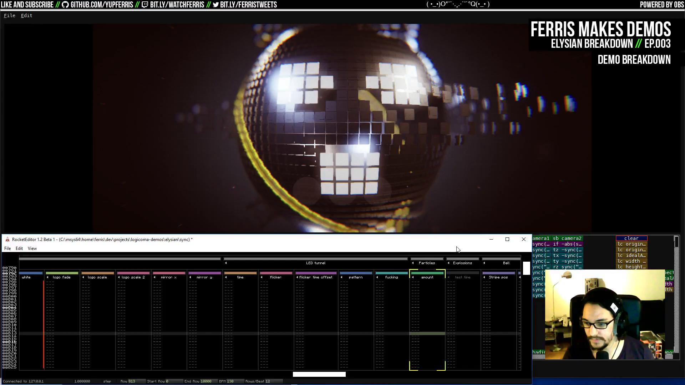
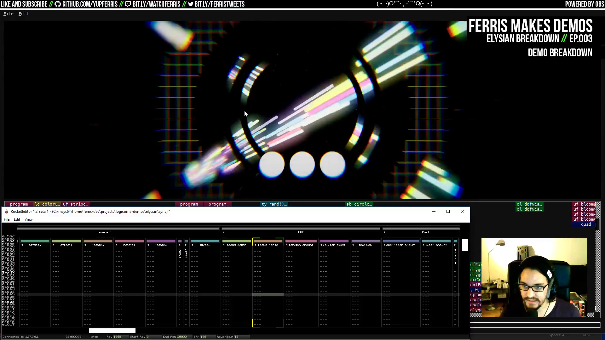
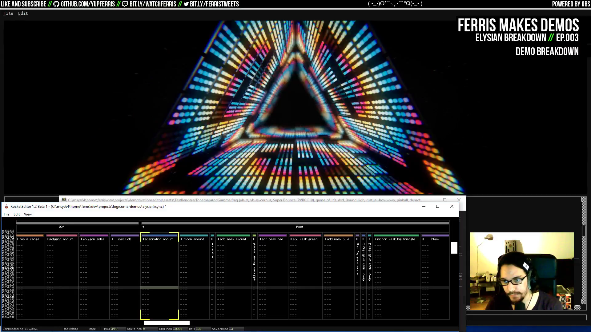
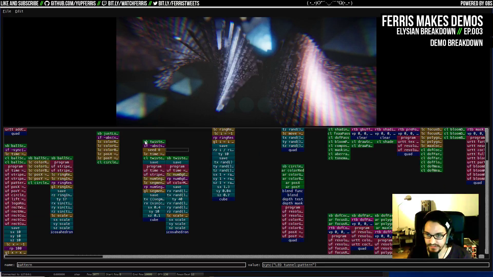
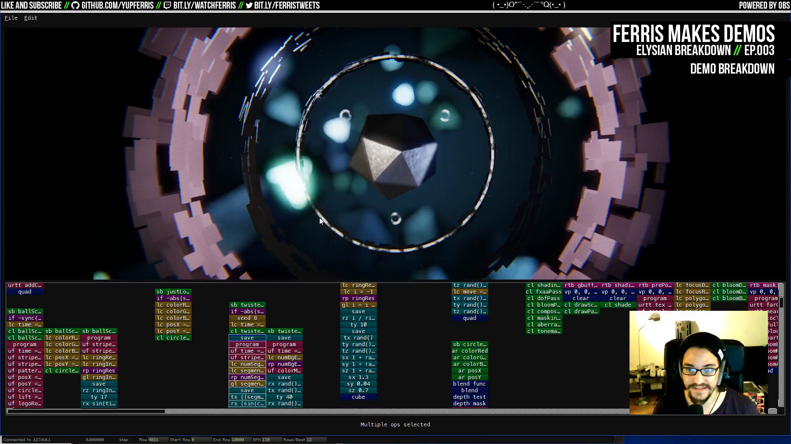
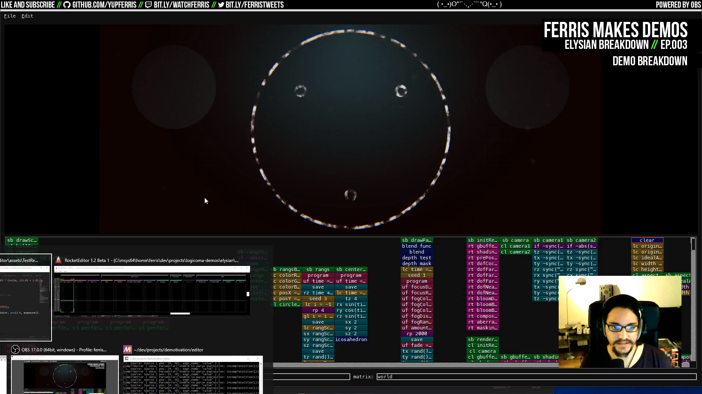
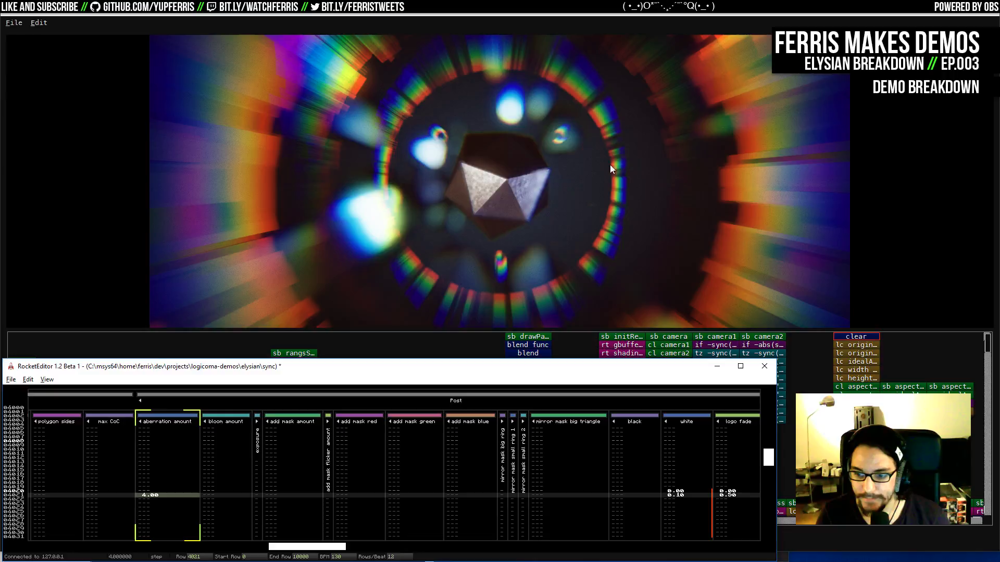

# Ep.003 - Elysian Breakdown - Notes

Notes on [Ferris Makes Demos Ep.003 - Elysian Breakdown][talk] by [ferris](https://github.com/yupferris).

[Elysian][elysian] by [Logicoma][LGC], 1st place in 64k pc demo at TRSAC 2016 October.

>  "I talk about feelings a lot when talking about demos, because that's what it is, you are doing [on the screen] what makes you feel good." `01:12:35`

Everything in the intro is meshes (`00:17:43`). 

Vertex data for the platonic solids is from Paul Borg's site (`00:32:20`).

Depth of Field method is from [Graphics Gems, Crytek paper][crytek-paper] (`01:23:15`). TODO link

[talk]: https://www.youtube.com/watch?v=DcsesTY6AxI

[LGC]: http://www.pouet.net/groups.php?which=12638

[elysian]: http://www.pouet.net/prod.php?which=68375

[crytek-paper]: http://www.crytek.com/download/Sousa_Graphics_Gems_CryENGINE3.pdf

## Talk TOC

- `00:01:45` windows on the screen (demotivation and sync tracker)
- `00:02:30` watch Elysian
- `00:06:35` variables in the sync tracker, interface explanation
- `00:10:50` **ball scene**
- `00:12:20` post-processing pipeline review, shading and lighting passes
- `00:14:50` scene subroutine call list
- `00:15:20` ball scene operator graph
- `00:17:00` one flat cube mesh piece
- `00:18:20` ring of flat cubes
- `00:19:25` ball of repeated cubes, not instanced
- `00:20:50` displacement and cut is in the shaders
- `00:23:00` change params of the displaced cubes
- `00:24:30` the stripe is discarded pixel fragments
- `00:27:05` a curve editor would be good in the tool
- `00:27:55` circle gradient background
- `00:28:10` color grading for warmer colors
- `00:32:05` parts of the ball scene
- `00:33:40` the ring is icosahedrons
- `00:34:40` background of the twister stripe scene
- `00:37:15` spikey displacement on the ball
- `00:38:30` floating particles in DOF
- `00:40:55` save operator and manipulating world matrices
- `00:44:10` ring scaling tweaks
- `00:45:20` **laser lines scene**
- `00:48:55` additive mask shapes
- `00:49:50` JIT and the 3D engine are compiled both in the tool and the intro
- `00:50:40` turn off bloom
- `00:51:05` mirroring masks
- `00:54:00` **LED tunnel scene**
- `00:55:40` the sides are repetitions
- `00:57:20` panels in the sides
- `00:59:35` color pattern selection on the LEDs
- `01:01:05` light pattern in the fragment shader
- `01:03:50` party vs. final version comments
- `01:05:35` **twister stripe scene**
- `01:10:00` twister material shader
- `01:12:35` "I talk about feelings a lot when talking about demos, because that's what it is, you are doing [on the screen] what makes you feel good."
- `01:13:15` syncing the scene with the music
- `01:15:10` twister background
- `01:18:25` **rangs scene with icosahedron**
- `01:22:40` moving the DOF
- `01:23:15` DOF is from Graphics Gems, Crytek paper
- `01:24:50` **final scene**
- `01:26:50` outputs of the different shader stages
- `01:27:15` the lighting is GGX with point lights
- `01:37:25` chromatic aberration explained

## Screenshots

- `00:10:50` **ball scene**

- `00:45:20` **laser lines scene**

- `00:54:00` **LED tunnel scene**

- `01:05:35` **twister stripe scene**

- `01:18:25` **rangs scene with icosahedron**

- `01:24:50` **final scene**

- `01:37:25` chromatic aberration explained

