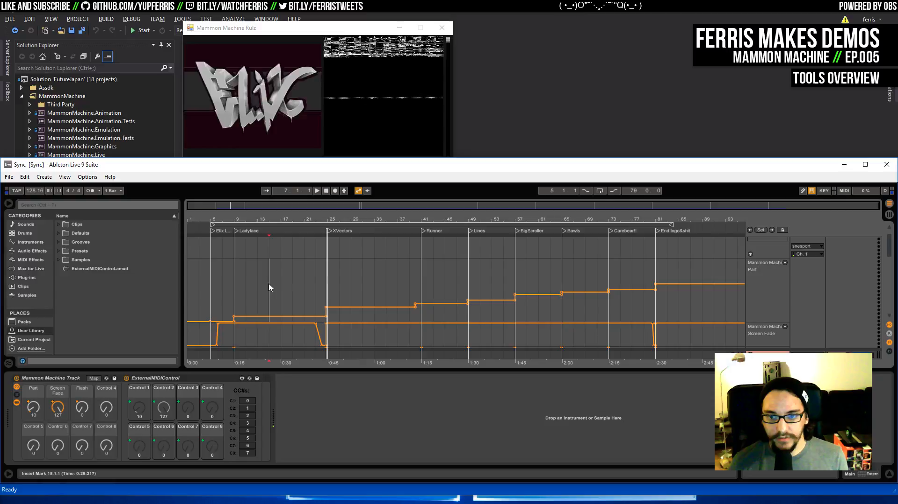
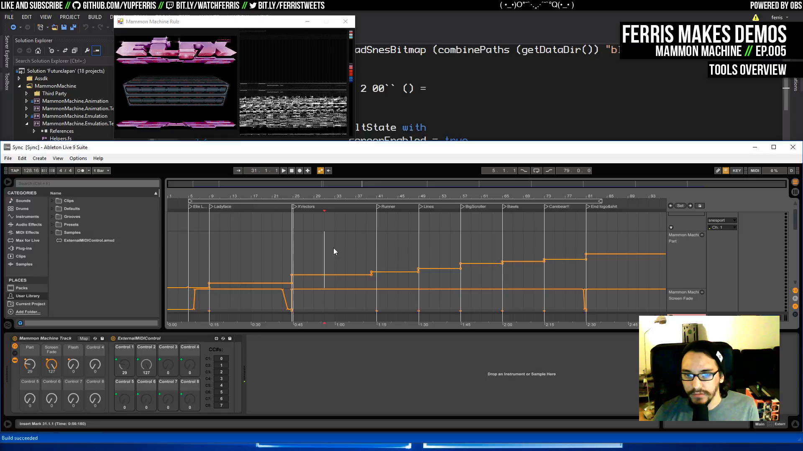

# Ep.005 - Mammon Machine - Notes

Notes on [Ferris Makes Demos Ep.005 - Mammon Machine][talk] by [ferris](https://github.com/yupferris).

*Mammon Machine* is a tool for making Super Nintendo demos by *ferris*.

Code is F#

Published demos with: Elix, alien.

Demo: Smash It, nu.

[talk]: https://www.youtube.com/watch?v=dMAeX0MCQmI

## Talk TOC

- `00:07:45` breakdown of the demo [Smash It][smash-it] as a way of demonstrating tool internals
- `00:08:15` UI windows overview: demo preview, Ableton Live, editor and code
- `00:10:55` watch [Smash It][smash-it], released at TRSAC 2014
- `00:14:45` write each effect as a program on its own while playing the music in the background
- `00:15:55` don't do cycle-counts by hand: this approach is a half-tracker, half-emulation thing
- `00:17:00` asset manager for the CPU gfx code and the VRAM contents
- `00:18:10` at every frame, call some function which talks to the sync system and loads content to VRAM
- `00:19:10` so you can use bytecode-based instructions to schedule everything to frame count
- `00:20:25` effects are in F# and everything gets compiled into the bytecode that the demo will load and run every frame
- `00:22:05` code overview: `Assdk` the assembler, `MammonMachine` is various gfx and animation libs
- `00:25:50` `MammonMachine.Emulator` not a Super Nintendo emulator, but an emulation of the video hardware: you want to be able to describe the state of the video hardware at a given point in time and then generate the bytecode that would get you to that state
- `00:26:35` `SnesState.fs` the emulator takes a description of that state and produces an image
- `00:29:25` `MammonMachine.EmulationTests` states are reproduced and compared to PNGs on the disk
- `00:33:10` show an example state (graphics output and video memory)
- `00:33:40` once we have a way to generate and visualize those states, then we want to generate those states for every frame that the demo is going to run. Then we can have a pass that goes through all those generated states. This pass will take a known starting state (the state that represents the state of the hardware at startup), and for all frames it will generate a little piece of bytecode that represents all the changes that have to be made to take the SNES from its current state into the state described by that state (data struct).
- `00:34:35` demonstrate syncing
- `00:35:05` i.e. this is an F# function which for a given time can give a Super Nintendo state. Then in Ableton Live you can run that state in a loop, generating a state displayed in the preview window.
- `00:35:50` tweak variables of the effect
- `00:38:55` `FutureJapan` demo overview
- `00:39:20` `ElixLogo.fs` effect
- ...

To be continued...

[smash-it]: TODO

## Screenshots

- `00:08:15` UI windows overview: demo preview, Ableton Live, editor and code

- `00:34:35` demonstrate syncing

